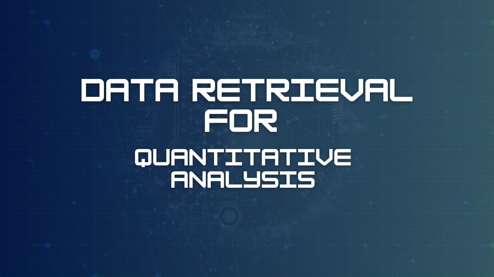
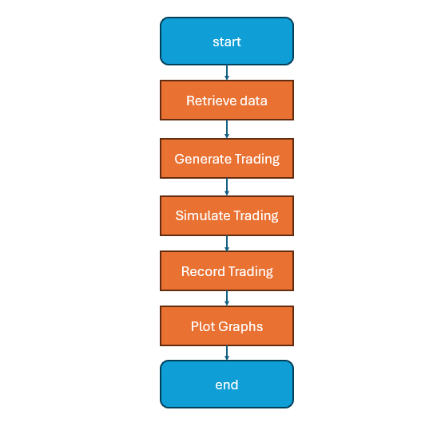

# Data Retrieval for Quantitative Analysis

# อธิบายเป้าหมาย

" ทดสอบประสิทธิภาพของกลยุทธ์การเทรด(การใช้ EMA21 ในการตัดสินใจซื้อขาย) กับข้อมูลราคาในอดีต การทำ Backtest 
ให้ข้อมูลเชิงสถิติเกี่ยวกับผลลัพธ์ที่อาจเกิดขึ้นหากใช้กลยุทธ์นี้ในช่วงเวลาที่กำหนด
แสดงภาพของการเคลื่อนไหวของราคาและผลกระทบของกลยุทธ์ต่อยอดเงินในบัญชี "

# flowchart

# Tools
Python (ในตัวอย่างจะใช้ Version 3.13.1 / ระบบปฏิบัติการ windows 11)
Library ที่ต้องลงเพิ่ม
 MetaTrader5 
 matplotlib.pyplot 
 pandas 
 numpy 
Visual Studio Code

# Process

1.Retrieve XAUUSD Price Data from MT5
2.Calculate EMA21 and Generate Trading Signals
3.Simulate Trading Based on Signals
4.Calculate and Record Trading Results
5.Display Results and Plot Graphs

